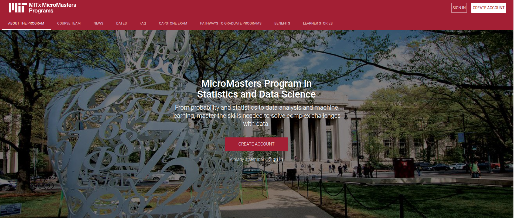
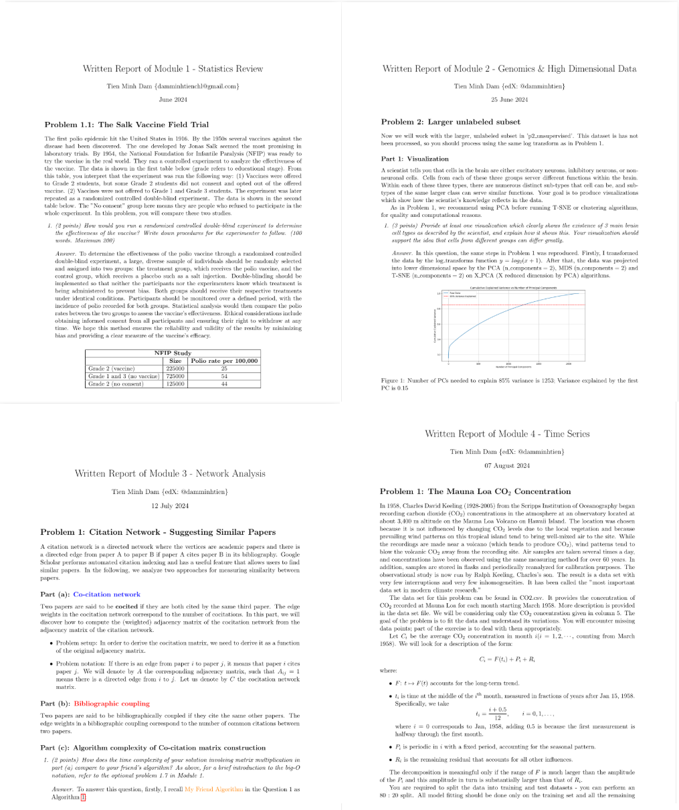
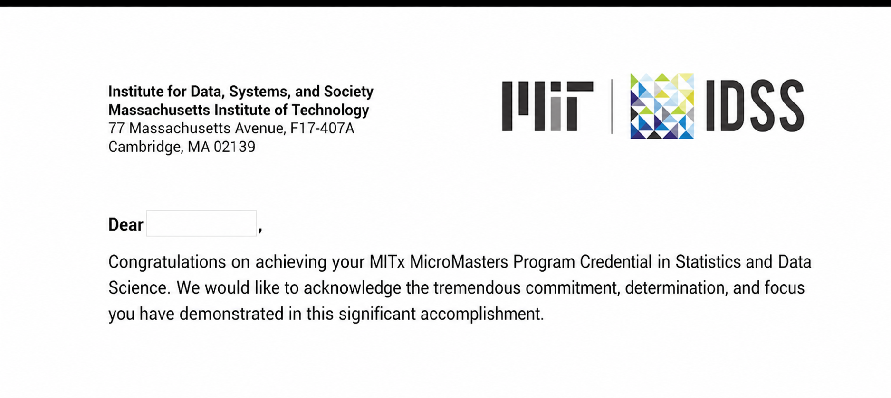
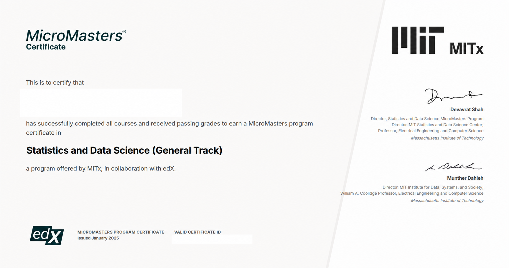

# MITx Statistics and Data Science Study Hub

A learner-maintained study archive for the MITx MicroMasters in Statistics and Data Science (SDS): course maps, personal notes, lecture assets, project write-ups, and capstone revision material.

> This is an independent learner project, not an MIT or edX publication. Course names, slides, trademarks, and third-party materials remain with their respective owners. See [content provenance](docs/PROVENANCE.md).

## Start here

- [Content map](docs/CONTENT_MAP.md) — the shortest route through the repository.
- [Project gallery](docs/PROJECTS.md) — reusable algorithms, notebooks, datasets, and run commands.
- [Showcases](docs/SHOWCASES.md) — selected program, report, and milestone artifacts.
- [Course quality notes](docs/QUALITY.md) — what is verified, incomplete, or still being cleaned.
- [Roadmap](ROADMAP.md) — the next milestones for making the archive more useful.
- [Contributing](CONTRIBUTING.md) — report a broken link, propose a correction, or add a study resource.
- [Notion study-notes mirror](https://damminhtien.notion.site/MITx-SDS-7866aebb7437458496c298bc49c350e3?pvs=4) — an external reading view; availability may change.
- [GitHub Pages study hub](https://damminhtien.github.io/mit-micromasters-program-in-statistics-and-data-science/) — a curated public front door for the archive.
- [MITx SDS official site](https://micromasters.mit.edu/ds/) — enrollment, current dates, and program policy.

## Featured reusable projects

The most reusable part of this archive is the project work. Each entry below links directly to an implementation or notebook so readers can inspect, run, adapt, or extend it.

| Project | Reusable core | Start here | Status |
| --- | --- | --- | --- |
| Matrix completion and recommendation | Gaussian-mixture EM, K-means baseline, BIC model selection, and matrix filling | [`project4_netflix`](6.86x_machinelearning/projects/project4_netflix/main.py) | Bundled toy data; smoke-tested |
| Sentiment classification | Bag-of-words features, perceptron, averaged perceptron, Pegasos, and tuning helpers | [`sentiment_analysis`](6.86x_machinelearning/projects/sentiment_analysis/project1.py) | Local TSV data; test harness passes |
| MNIST model baselines | PCA, softmax regression, fully connected and convolutional PyTorch models | [`mnist`](6.86x_machinelearning/projects/mnist/part1/softmax.py) | Educational reference; local data included |
| High-dimensional analysis | PCA, MDS, t-SNE, clustering, and unsupervised feature selection | [`Analysis1.ipynb`](6.419x_dataanalysis/projects/Analysis1.ipynb) | Notebook workflow; course data may be required |
| Dynamic network analysis | Phase-by-phase CAVIAR network exploration | [`Analysis3_1.ipynb`](6.419x_dataanalysis/projects/Analysis3_1.ipynb) | Notebook plus phase CSVs |

See the [full project gallery](docs/PROJECTS.md) for reusable files, setup commands, limitations, and reproducibility notes.

## Learning journey showcases

These snapshots preserve the personal story behind the projects while keeping the reusable work above as the primary entry point. The [showcase gallery](docs/SHOWCASES.md) adds captions, provenance, and links to the underlying artifacts.

  
  

  
  

The letter and certificate are owner-provided milestones. Some images may contain personal identifiers; review them before redistributing this README outside GitHub.

## Program map

The current credential structure is three core courses, one elective, and a separate capstone exam. The elective can be 6.419x or 14.310x; this repository contains local material for 6.419x only.

| Requirement | Course | Local material |
| --- | --- | --- |
| Core | [6.431x Probability](6.431x_probability/README.md) | Notes, lecture PDFs, study resources |
| Core | [18.6501x Fundamentals of Statistics](18.6501x_statistics/README.md) | Notes, lecture PDFs, reference links |
| Core | [6.86x Machine Learning](6.86x_machinelearning/README.md) | Notes, projects, lecture PDFs |
| Elective | [6.419x Data Analysis](6.419x_dataanalysis/README.md) | Notes, projects, reports, lecture material |
| Elective | 14.310x Data Analysis for Social Scientists | Not archived here; see the official program site |
| Capstone | [SDS capstone archive](ds.cfx_capstoneexam/README.md) | Recaps and revision sheets |

For the authoritative requirement and eligibility rules, use the [MIT SDS FAQ](https://micromasters.mit.edu/ds/faq/). Course links may require an authenticated edX session and can expire between cohorts.

## What this repository contains

- **Conceptual notes:** probability, statistical inference, machine learning, high-dimensional data, networks, and time series.
- **Working examples:** notebooks, projects, written analyses, and recap sheets.
- **Runbooks:** dependency and path guidance for the [Data Analysis projects](6.419x_dataanalysis/projects/README.md) and [Machine Learning projects](6.86x_machinelearning/projects/README.md).
- **Imported references:** a separately labelled collection of external notes under [`resources/jokerdii_notes`](resources/jokerdii_notes/README.md).
- **Personal learning record:** selected reflections, reports, and milestones in the [showcase gallery](docs/SHOWCASES.md).

The notes are not equally complete. A status marker in the [content map](docs/CONTENT_MAP.md) is more reliable than assuming that every linked file is a finished chapter.

## Why this project exists

The goal is to make a demanding program easier to navigate without pretending that a personal archive is an official syllabus. Each useful contribution should improve at least one of these properties:

1. **Findability:** a learner can reach the right note in one or two clicks.
2. **Trust:** each item has a source, cohort or date, and clear ownership.
3. **Reproducibility:** local links work from a fresh clone and examples explain their dependencies.
4. **Learning value:** summaries distinguish intuition, assumptions, formulas, and limitations.

If this archive saves you time, [star the repository](https://github.com/damminhtien/mit-micromasters-program-in-statistics-and-data-science) and open an issue with the next broken link or unclear explanation you find.

## Citation

If you reference the archive in a project, use the included [CITATION.cff](CITATION.cff).
