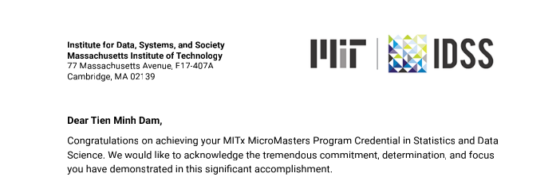
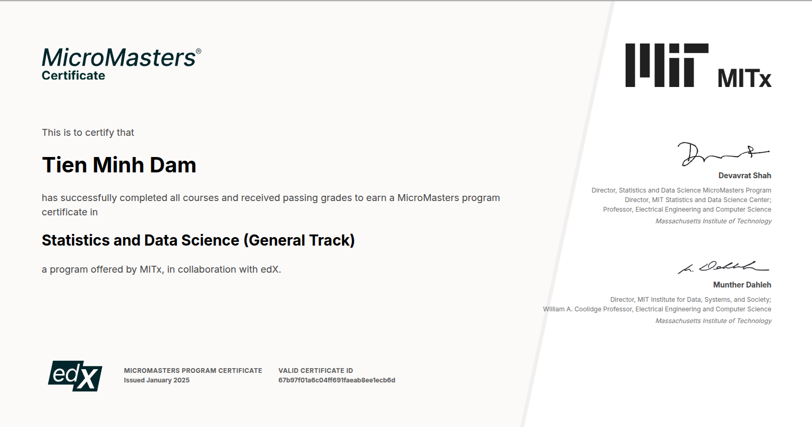

# Showcases

This gallery preserves the visible milestones and artifacts behind the study archive. The images are owner-provided snapshots unless explicitly described as program context; they are not official MIT or edX endorsements.

## Program context

Program context for the learning journey. Use the [official MIT SDS site](https://micromasters.mit.edu/ds/) for current program rules, dates, and eligibility.

## Written report artifact

Preview of a written-analysis workflow. The associated personal reports are indexed in [`6.419x_dataanalysis/written_reports/`](../6.419x_dataanalysis/written_reports/README.md) and should be read as learner work, not official solutions.

## Program letter

Owner-provided program milestone. The image is retained for provenance and personal context; it does not establish current enrollment or program policy.

## Certificate

Owner-provided completion milestone. This image may contain a credential identifier, so anyone publishing a fork or derivative should review whether to redact it first.

## Personal study-notes mirror

The original [Notion study-notes mirror](https://damminhtien.notion.site/MITx-SDS-7866aebb7437458496c298bc49c350e3?pvs=4) is kept as an external reading route. It may require access or change independently of this repository.

## Navigation

- [Content map](CONTENT_MAP.md)
- [6.419x written reports](../6.419x_dataanalysis/written_reports/README.md)
- [6.419x Data Analysis projects](../6.419x_dataanalysis/projects/README.md)
- [Provenance and licensing](PROVENANCE.md)
